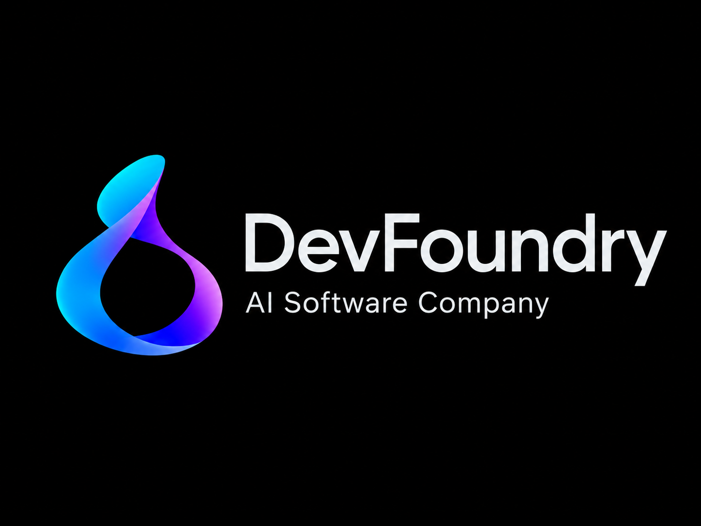
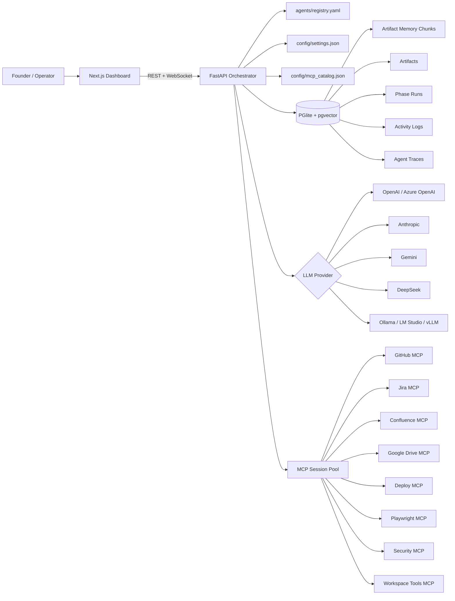
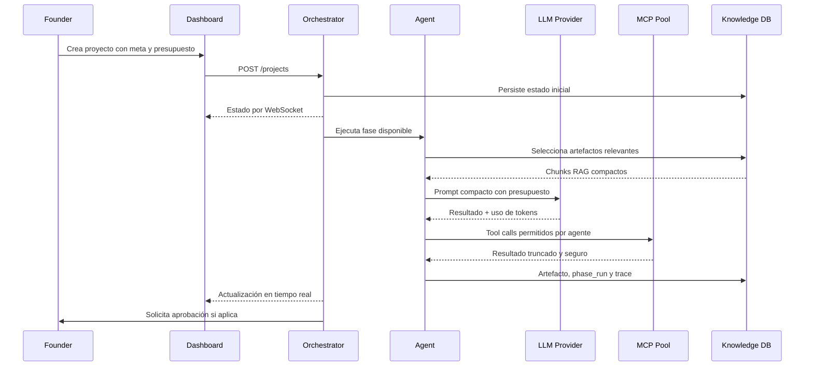
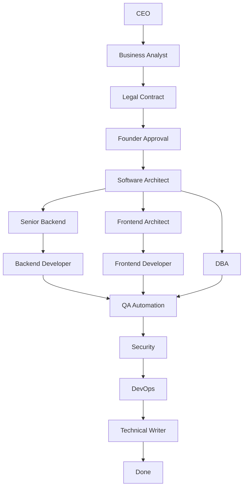
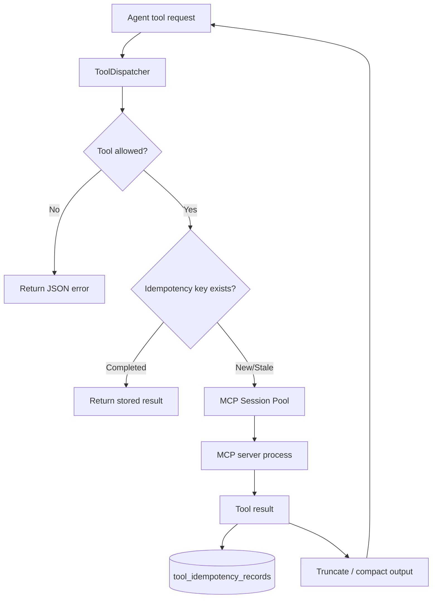
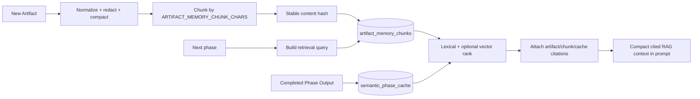
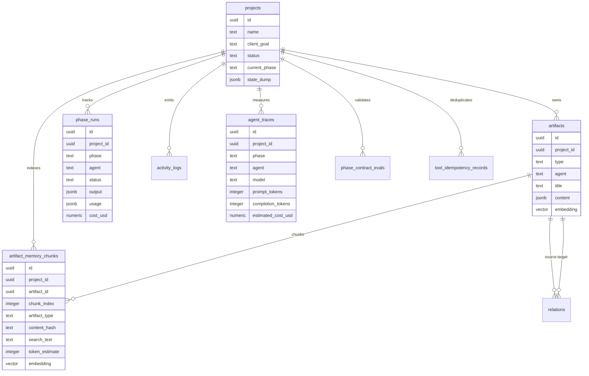
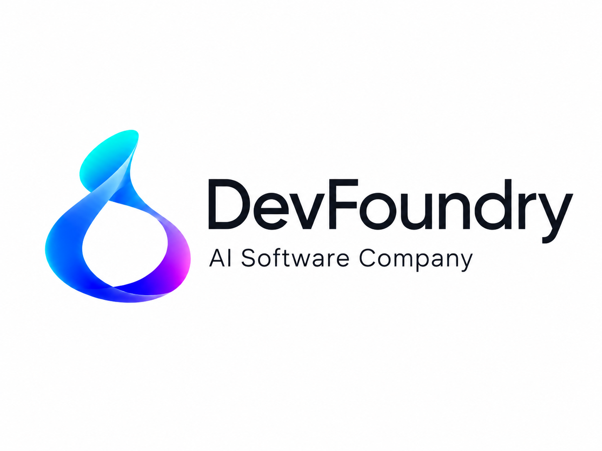

<div align="center">
  
</div>

# Software Company AI Factory

> [!WARNING]
> **Proyecto Experimental e Inconcluso**
> Este proyecto es de naturaleza experimental y actualmente se encuentra en desarrollo (inconcluso). Las funcionalidades, arquitectura y herramientas pueden cambiar o presentar inestabilidad.




Software Company AI Factory es un motor de agentes IA para operar una empresa de desarrollo de software: recibe una meta de cliente, la divide en fases, coordina agentes especializados, ejecuta herramientas MCP, registra artefactos, controla aprobaciones humanas y mide uso/costo de modelos.


El proyecto combina un dashboard operativo, un orquestador FastAPI, servidores MCP, una base de conocimiento local con PGlite/pgvector y un registro configurable de agentes. Esta base está pensada para evolucionar hacia un motor competitivo de agentes: observable, extensible, controlado por permisos y optimizado para ahorrar tokens.

## Tabla De Contenido

- [Propósito](#propósito)
- [Vista Del Producto](#vista-del-producto)
- [Stack Tecnológico](#stack-tecnológico)
- [Arquitectura](#arquitectura)
- [Flujo De Agentes](#flujo-de-agentes)
- [Servicios Y Puertos](#servicios-y-puertos)
- [Configuración](#configuración)
- [Arranque](#arranque)
- [Uso Del Dashboard](#uso-del-dashboard)
- [MCP Y Herramientas](#mcp-y-herramientas)
- [Base De Conocimiento](#base-de-conocimiento)
- [Seguridad](#seguridad)
- [Optimización De Tokens](#optimización-de-tokens)
- [Capturas E Ilustraciones](#capturas-e-ilustraciones)
- [Colaboradores](#colaboradores)
- [Roadmap](#roadmap)

## Propósito

El objetivo del sistema es automatizar el ciclo de entrega de software con una organización de agentes:

- Captura y descomposición de objetivos de negocio.
- Generación de BRD, historias de usuario, riesgos y contrato.
- Aprobación humana antes de continuar con fases comprometidas.
- Diseño de arquitectura, contratos API, backend, frontend y base de datos.
- QA, seguridad, DevOps, documentación y cierre.
- Integración con herramientas externas mediante MCP.
- Persistencia de artefactos, logs, trazas y costos estimados.

No es solo un chatbot. El diseño apunta a una fábrica de software con estado, permisos, memoria, herramientas reales y visibilidad operativa.

## Vista Del Producto

| Área | Descripción |
| --- | --- |
| Dashboard | Consola Next.js para proyectos, agentes, MCPs, workspace, artefactos y actividad. |
| Orquestador | API FastAPI que administra fases, dependencias, aprobaciones, WebSocket y ejecución de agentes. |
| Agentes | Registro YAML con roles, skills, herramientas, modelos y entregables por agente. |
| Oficina pixel | Vista complementaria del flujo con personajes pixelados asignados por `sexo` del agente. |
| MCP | Servidores para GitHub, Jira, Confluence, Google Drive, despliegue, Playwright, seguridad y workspace tools. |
| Memoria | PGlite Socket con esquema PostgreSQL, pgvector, artefactos, logs, phase runs y agent traces. |
| Memoria RAG | Índice persistente de chunks de artefactos para recuperar contexto relevante sin reenviar todo el historial. |
| Costos | Presupuestos de tokens por fase, límites de tool calls, truncado de salidas y costo estimado por proyecto. |

## Stack Tecnológico

| Capa | Tecnología | Versión / Referencia |
| --- | --- | --- |
| Frontend | Next.js | `15.5.19` |
| UI | React | `19.0.0` |
| Tipado | TypeScript | `5.7.2` |
| Estilos | Tailwind CSS | `3.4.17` |
| Diagramas UI | `@xyflow/react` | `12.3.6` |
| Animación | Framer Motion | `12.40.0` |
| Markdown | `react-markdown`, `remark-gfm`, Mermaid, KaTeX | Dashboard artifacts |
| Backend | FastAPI | `>=0.115.6` |
| Servidor ASGI | Uvicorn | `>=0.32.1` |
| Modelos | OpenAI SDK, Anthropic SDK, Gemini SDK, DeepSeek compatible OpenAI | Configurable por agente |
| MCP SDK | `mcp` Python package | `>=1.1.2` |
| Base local | PGlite Socket | `@electric-sql/pglite ^0.4.6` |
| Vectores | pgvector / PGlite vector extension | `vector(768)` |
| DB Client | psycopg 3 | `>=3.2.3` |
| Contenedores | Docker Compose | Servicios aislados |
| Automatización QA | Playwright | `>=1.40.0` |
| Seguridad | Bandit, npm audit, ZAP API hook | MCP security |

### Proveedores LLM Soportados

<p>
  
  
  
  
  
  
  
  
</p>

## Arquitectura



### Secuencia De Ejecución



## Flujo De Agentes

El pipeline se define en `orchestrator/project_service.py` y se alimenta desde `agents/registry.yaml`.



### Agentes Principales

Cada agente puede definir `sexo` (`femenino`, `masculino` o `no_especificado`). El dashboard lo usa para asignar dinámicamente personajes pixelados en la vista `Oficina`, sin reemplazar el avatar original del agente.

| Agente | Rol | Entregables |
| --- | --- | --- |
| CEO Agent | Dirección, planificación y aprobación | Project plan, task DAG, approval report |
| Business Analyst Agent | Descubrimiento, BRD, user stories | BRD, user stories, risk register |
| Legal Contract Agent | Contrato y control legal | Contract markdown, contract PDF |
| Software Architect Agent | Arquitectura y contratos | Architecture diagram, OpenAPI contracts, ADRs |
| Senior Backend Agent | Patrones y revisión backend | Backend patterns, skeleton, review comments |
| Backend Developer Agent | Implementación backend | Backend code, migrations, tests |
| Frontend Architect Agent | Diseño UI y estructura | Wireframes, component architecture, Storybook plan |
| Frontend Developer Agent | Implementación frontend | Frontend code, UI tests |
| DBA Agent | Modelo de datos | DDL, indexes, query review |
| QA Automation Agent | Pruebas y defectos | QA report, bug tickets |
| Security Agent | Revisión OWASP y dependencias | Security report, remediation tickets |
| DevOps Engineer Agent | CI/CD y despliegue | Staging URL, production URL, CI workflows |
| Technical Writer Agent | Documentación | README, user manual, API docs |

## Servicios Y Puertos

| Servicio | Puerto | Descripción |
| --- | ---: | --- |
| Dashboard | `3000` | UI principal |
| Orchestrator | `8000` | API, Swagger y WebSocket |
| GitHub MCP | `8010` | Repos, ramas, commits, pull requests |
| Jira MCP | `8011` | Issues, comentarios, transiciones |
| Confluence MCP | `8012` | Páginas Markdown/HTML |
| Google Drive MCP | `8013` | Archivos y permisos |
| Deploy MCP | `8014` | Vercel y Railway CLI |
| Playwright MCP | `8015` | Smoke/E2E y screenshots |
| Security MCP | `8016` | Bandit, npm audit y ZAP |
| Workspace Tools MCP | `8017` | Archivos, comandos, fetch, web search, clima, divisas |
| Knowledge DB | `5432` | PGlite Socket con esquema PostgreSQL |

## Configuración

1. Copia el archivo de ejemplo.

```bash
cp .env.example .env
```

2. Configura al menos un proveedor LLM.

```env
DEFAULT_LLM_PROVIDER=openai
DEFAULT_LLM_MODEL=gpt-4.1-mini
OPENAI_API_KEY=
```

3. Para una demo visual sin credenciales completas, deja:

```env
LLM_STRICT=false
```

Con `LLM_STRICT=false`, una fase sin credenciales puede producir un artefacto pendiente en lugar de detener todo el flujo. Para ejecución real de cliente usa:

```env
LLM_STRICT=true
```

### Variables Críticas

| Variable | Uso |
| --- | --- |
| `NEXT_PUBLIC_ORCHESTRATOR_URL` | URL pública del orquestador usada por el dashboard |
| `NEXT_PUBLIC_MINIVERSE_URL` | URL opcional de un servidor Miniverse externo para sincronizar heartbeats de la oficina pixel |
| `ORCHESTRATOR_API_KEY` | API key opcional para proteger la API |
| `ORCHESTRATOR_REQUIRE_API_KEY` | Si es `true`, bloquea requests sin key |
| `ORCHESTRATOR_CORS_ORIGINS` | Orígenes permitidos por CORS |
| `TOOL_POLICY_MODE` | Modo inicial de acceso a herramientas: `approval_required` o `full_access` |
| `VOICE_CONVERSATIONS_ENABLED` | Activa por defecto las conversaciones de voz en Factory |
| `CHATTERBOX_ENABLED` | Habilita el backend local Chatterbox TTS |
| `CHATTERBOX_DEVICE` | Dispositivo para Chatterbox: `cpu` o `cuda` |
| `CHATTERBOX_VOICE_FEMENINO` | WAV local de referencia para agentes femeninos |
| `CHATTERBOX_VOICE_MASCULINO` | WAV local de referencia para agentes masculinos |
| `CHATTERBOX_VOICE_NEUTRAL` | WAV local de referencia para agentes sin sexo especificado |
| `DEFAULT_LLM_PROVIDER` | Proveedor por defecto |
| `DEFAULT_LLM_MODEL` | Modelo por defecto |
| `MAX_INPUT_TOKENS_PER_PHASE` | Presupuesto máximo de entrada por fase |
| `MAX_OUTPUT_TOKENS_PER_PHASE` | Límite de salida por fase |
| `MAX_ARTIFACT_CONTEXT_TOKENS` | Contexto máximo tomado de artefactos |
| `ARTIFACT_MEMORY_ENABLED` | Activa o desactiva la memoria persistente de artefactos |
| `ARTIFACT_MEMORY_CONTEXT_TOKENS` | Tokens máximos recuperados desde el índice RAG por fase |
| `ARTIFACT_MEMORY_CHUNK_CHARS` | Tamaño aproximado de cada chunk indexado |
| `ARTIFACT_MEMORY_MAX_CHUNKS_PER_ARTIFACT` | Chunks máximos generados por artefacto |
| `ARTIFACT_MEMORY_MAX_CANDIDATE_CHUNKS` | Candidatos máximos leídos desde DB antes del ranking |
| `ARTIFACT_MEMORY_EMBEDDINGS_ENABLED` | Activa embeddings reales para ranking híbrido; desactivado por defecto para controlar costo |
| `ARTIFACT_MEMORY_VECTOR_CANDIDATES` | Candidatos máximos recuperados por similitud vectorial |
| `ARTIFACT_MEMORY_HYBRID_ALPHA` | Peso del ranking vectorial frente al lexical; `0.65` por defecto |
| `EMBEDDINGS_PROVIDER` | Proveedor de embeddings; actualmente `openai` |
| `EMBEDDING_MODEL` | Modelo de embeddings, por ejemplo `text-embedding-3-small` |
| `EMBEDDING_DIMENSIONS` | Dimensión esperada del vector; el esquema usa `768` |
| `SEMANTIC_CACHE_ENABLED` | Activa cache semántico de salidas de fase para reutilizar contexto validado |
| `SEMANTIC_CACHE_AUTO_REUSE` | Si es `true`, permite reutilizar una salida exacta sin llamar al modelo; por defecto `false` |
| `SEMANTIC_CACHE_MIN_SCORE` | Score mínimo para inyectar un resultado previo similar |
| `SEMANTIC_CACHE_MAX_ITEMS` | Máximo de entradas de cache inyectadas al prompt |
| `SEMANTIC_CACHE_CONTEXT_TOKENS` | Presupuesto de tokens para contexto del semantic cache |
| `SEMANTIC_CACHE_CANDIDATES` | Candidatos leídos desde DB para ranking del semantic cache |
| `PHASE_CONTRACTS_ENABLED` | Activa contratos estrictos por agente/fase antes de persistir artefactos |
| `PHASE_CONTRACT_AUTOFIX` | Permite normalizar salidas incompletas sin perder trazabilidad |
| `PHASE_CONTRACT_SCHEMA_RESPONSE_FORMAT` | Usa `json_schema` en proveedores compatibles; mantiene fallback a `json_object` |
| `MAX_TOOL_TURNS_PER_PHASE` | Máximo de iteraciones de herramientas |
| `MAX_TOOL_OUTPUT_CHARS` | Truncado de salidas MCP |
| `MAX_PROJECT_COST_USD` | Límite de costo estimado por proyecto; `0` desactiva el corte |
| `MCP_SESSION_IDLE_SECONDS` | TTL de sesiones MCP inactivas |
| `MCP_SESSION_MAX_USES` | Reciclaje por número de usos de sesión MCP |
| `MCP_TOOL_CALL_TIMEOUT_SECONDS` | Timeout por llamada de herramienta |
| `TOOL_IDEMPOTENCY_ENABLED` | Activa idempotency keys para tool calls externas con side effects |
| `TOOL_IDEMPOTENCY_STALE_SECONDS` | Tiempo tras el cual una reserva `running` se considera recuperable |
| `TOOL_IDEMPOTENCY_LOCAL_WRITES` | Si es `true`, también protege escrituras locales como `write_file` |
| `WORKSPACE_ALLOWED_COMMANDS` | Lista de comandos permitidos en workspace tools |
| `WORKSPACE_ALLOW_UNSAFE_COMMANDS` | Habilita shell chaining riesgoso; debe permanecer `false` por defecto |

### Archivos De Configuración

| Archivo | Propósito |
| --- | --- |
| `.env.example` | Plantilla segura de variables |
| `config/settings.json` | Nombre de compañía, tema, fundador y colaboradores |
| `agents/registry.yaml` | Agentes, modelos, skills, tools y deliverables |
| `config/mcp_catalog.json` | Catálogo de MCPs administrable desde dashboard |
| `config/mcp_env/*.env` | Variables por servidor MCP generadas por el vault |
| `knowledge_base/init.sql` | Esquema de proyectos, artefactos, logs, traces y vectores |
| `docker-compose.yml` | Topología local completa |

## Arranque

### Opción 1: Docker Compose

```bash
docker compose up --build
```

Abrir:

```text
Dashboard:       http://localhost:3000
Orchestrator:    http://localhost:8000/docs
MCP status:      http://localhost:8000/mcp/status
Knowledge DB:    localhost:5432
```

Detener:

```bash
docker compose down
```

Eliminar también la data local de PGlite:

```bash
docker compose down -v
```

### Opción 2: Arranque Local En Una Consola

Windows:

```powershell
.\start_local.ps1
```

Node launcher directo:

```bash
node start_local.mjs
```

El launcher crea virtualenvs si faltan, instala dependencias Python y levanta dashboard, orquestador y MCPs.

## Uso Del Dashboard

1. Abre `http://localhost:3000`.
2. Crea un proyecto con nombre, objetivo de cliente y presupuesto.
3. Observa el workflow de fases en tiempo real.
4. Revisa artefactos, actividad y logs.
5. Aprueba o rechaza el contrato cuando el flujo llegue a `founder_approval`.
6. Ajusta agentes, MCPs, proveedores y configuración desde las vistas laterales.
7. Usa el bloque `Costo / Tokens` del panel derecho para revisar consumo real por proyecto, costo estimado, tokens cacheados, fase de mayor uso y avance contra `MAX_PROJECT_COST_USD`.
8. Reproduce la ejecución desde `Trace Replay`: llamadas LLM, herramientas, aprobaciones, duración, estado y evidencia compacta por fase.
9. Supervisa bloqueos desde `Mission Control` y `Human Inbox`: progreso, fase activa, costo, secretos faltantes, aprobaciones y errores recientes.
10. Activa `Voz de agentes` en `Mission Control` para escuchar intervenciones breves por agente. Si `CHATTERBOX_ENABLED=true` y `chatterbox-tts` está instalado, el audio se genera localmente y se cachea en `data/voice_cache`; si no, el dashboard usa Web Speech API como fallback. Esta capa no llama modelos LLM ni consume tokens.

### Vistas Principales

| Vista | Función |
| --- | --- |
| Factory | Crear proyectos, seguir fases, aprobar contrato y revisar artefactos |
| Workspace | Ver y editar archivos del workspace |
| Organization | Departamentos, skills y deliverables |
| Agents | Configuración de agentes, modelos y herramientas |
| MCP Servers | Catálogo MCP, permisos por agente y exportación |
| Settings | Marca, idioma, tema y prompt base |

### Endpoints Operativos De Proyecto

| Endpoint | Uso |
| --- | --- |
| `GET /projects/{project_id}/traces?limit=100` | Lista eventos recientes de agentes con tokens, modelo, proveedor y costo estimado |
| `GET /projects/{project_id}/usage` | Resume tokens, costo, presupuesto, consumo por fase, agente y modelo |
| `GET /projects/{project_id}/tool-approvals` | Lista aprobaciones pendientes o decididas para herramientas de riesgo |
| `POST /projects/{project_id}/tool-approvals/{approval_id}/decision` | Aprueba o deniega una herramienta bloqueada por política |

## MCP Y Herramientas

El sistema usa un dispatcher central que valida cada herramienta antes de ejecutarla. Un agente solo puede llamar herramientas declaradas en `agents/registry.yaml`.



### MCPs Incluidos

| MCP | Estado | Uso |
| --- | --- | --- |
| `github_mcp` | Implementado | Repositorios, commits, branches, pull requests |
| `jira_mcp` | Implementado | Issues, épicas, bugs, comentarios |
| `confluence_mcp` | Implementado | Publicación de documentación |
| `google_drive_mcp` | Implementado | Archivos, carpetas y permisos |
| `deploy_mcp` | Implementado | Vercel y Railway |
| `playwright_mcp` | Implementado | Smoke tests, E2E y screenshots |
| `security_mcp` | Implementado | Bandit, npm audit, ZAP API |
| `workspace_tools` | Implementado | File IO, comandos permitidos, fetch, web search |

El pool MCP mantiene sesiones stdio por servidor, evita abrir procesos en cada llamada, recicla sesiones por TTL/uso y cierra limpio al apagar FastAPI.

## Base De Conocimiento

La base local usa PGlite Socket con extensión vectorial. El esquema se aplica al arrancar el orquestador.

Además de guardar artefactos completos, el sistema crea un índice persistente en `artifact_memory_chunks`. Cada artefacto se transforma en texto compacto, se divide en chunks, se calcula un hash estable y se guarda con estimación de tokens. Si `ARTIFACT_MEMORY_EMBEDDINGS_ENABLED=true` y hay credenciales del proveedor, cada chunk guarda un embedding real en `vector(768)`; si no, el sistema mantiene recuperación lexical sin simular vectores. Antes de llamar al modelo, cada fase consulta ese índice por proyecto, fase, objetivo y entregables esperados. El prompt recibe solo los chunks más útiles con citations del tipo `artifact:<artifact_id>#chunk:<chunk>`.

El semantic cache guarda salidas completadas por fase en `semantic_phase_cache`. En ejecuciones posteriores, el orquestador puede inyectar resúmenes validados similares como contexto compacto con citations `semantic-cache:<cache_id>`. Por seguridad, `SEMANTIC_CACHE_AUTO_REUSE=false` evita saltarse llamadas al modelo salvo que se active explícitamente.

Cada fase completada genera también un eval automático en `retrieval_evals`. El eval compara las citations disponibles en memoria/cache contra las citations realmente usadas por el modelo, calcula un score de cobertura y marca estados como `passed`, `unused_context`, `cited_unknown` o `no_context`.

Antes de persistir un artefacto, `phase_contracts.py` construye un JSON Schema a partir de los deliverables definidos en `agents/registry.yaml`. En proveedores compatibles se solicita `response_format=json_schema`; si el proveedor no lo soporta, se usa fallback seguro y se valida de todas formas en backend. Las salidas incompletas se normalizan cuando `PHASE_CONTRACT_AUTOFIX=true`, pero quedan registradas en `phase_contract_evals` con issues y correcciones.

Además, `phase_quality_evals` valida la estructura del entregable, presencia de entregables esperados según `agents/registry.yaml`, arrays obligatorios, tool calls fallidas, tool calls duplicadas y uso de herramientas sensibles. El resultado se muestra en el panel `Quality Gate`.

Las llamadas externas con side effects se protegen con `tool_idempotency_records`. Antes de ejecutar acciones como crear repositorios, branches, commits, issues, páginas, archivos en Drive o despliegues, el dispatcher calcula una key estable por proyecto/fase/agente/tool/argumentos. Si la misma acción ya terminó, devuelve el resultado persistido; si está corriendo, bloquea el duplicado; si falló o quedó stale, permite reintento controlado. Esto evita duplicados reales durante retries, recuperación desde checkpoints o errores transitorios.





## Seguridad

Medidas ya integradas:

- API key opcional para rutas del orquestador.
- CORS restringido por `ORCHESTRATOR_CORS_ORIGINS`.
- Redacción de secretos antes de persistir logs.
- Validación de tool calls contra el registro del agente.
- Comandos de workspace ejecutados sin shell por defecto.
- Bloqueo de operadores de shell y fragmentos peligrosos.
- Lista explícita de comandos permitidos.
- Idempotencia persistente para herramientas externas con side effects.
- Switch operativo `Con aprobacion / Acceso completo` para decidir si las herramientas externas con cambios reales deben pausar el flujo.
- Variables por MCP separadas en `config/mcp_env`.
- `.env`, secretos runtime y data local excluidos de Git.

Recomendación operativa: mantener `ORCHESTRATOR_REQUIRE_API_KEY=true` en entornos compartidos, usar una key distinta para dashboard/orquestador y dejar `TOOL_POLICY_MODE=approval_required` salvo en entornos locales o controlados donde se quiera ejecucion autonoma completa.

## Voz De Agentes

La capa de voz usa [Chatterbox TTS](https://github.com/resemble-ai/chatterbox) como motor local opcional. Chatterbox se instala aparte para no hacer pesado el arranque base:

```bash
pip install -r orchestrator/requirements-voice.txt
```

Luego configura `CHATTERBOX_ENABLED=true`. Puedes asignar referencias WAV por sexo con `CHATTERBOX_VOICE_FEMENINO`, `CHATTERBOX_VOICE_MASCULINO` y `CHATTERBOX_VOICE_NEUTRAL`. Las frases se generan de forma deterministica desde eventos del flujo; no se envian prompts, artefactos ni contexto al LLM.

## Optimización De Tokens

El proyecto incluye controles para reducir costo y ruido contextual:

- Selección compacta de artefactos relevantes por fase.
- Índice persistente de chunks de artefactos en `artifact_memory_chunks`.
- Recuperación RAG por proyecto/fase antes de construir el prompt.
- Ranking híbrido lexical/vectorial cuando `ARTIFACT_MEMORY_EMBEDDINGS_ENABLED=true`.
- Citations obligatorias en cada chunk inyectado al prompt.
- Semantic cache de salidas de fase para reutilizar contexto validado.
- Panel `Context Economy` con tokens de contexto enviados, tokens evitados, cache hits y uso de citations.
- Evals automáticos de recuperación por fase con score, estado y fases que requieren revisión.
- Contratos JSON Schema por agente/fase generados desde `agents/registry.yaml`.
- Autocorrección trazable de salidas incompletas antes de persistir artefactos.
- Evals de calidad de entregables con estructura, entregables esperados y side-effect safety.
- Idempotency keys para tool calls externas, evitando replays duplicados en GitHub, Jira, Confluence, Drive y despliegues.
- Panel `Quality Gate` con score de calidad, contratos válidos, autocorrecciones, side effects, replays evitados y fases a revisar.
- Hash estable para reindexar artefactos sin duplicar chunks.
- Presupuesto de entrada por fase.
- Límite de salida por fase.
- Límite de tool turns por fase.
- Truncado de tool outputs.
- Registro de `usage`, `estimated_cost_usd` y `prompt_budget`.
- Spans `llm_call` y `tool_call` con duración, estado, modelo/proveedor, argumentos compactos, preview de resultados y aprobaciones requeridas.
- Corte opcional por `MAX_PROJECT_COST_USD`.
- Resumen agregado en `GET /projects/{project_id}/usage` para alinear backend, presupuesto y dashboard.
- Panel `Costo / Tokens` con tokens totales, tokens cacheados, costo estimado y fase/agente de mayor consumo.
- Panel `Trace Replay` para reconstruir la ejecución por fase sin revisar logs crudos.
- `Mission Control` sobre el grafo de agentes con progreso, fase activa, costo, eventos y alertas de presupuesto/error.
- `Human Inbox` con decisiones humanas pendientes: contrato, intervención, tool approvals y secretos MCP faltantes.
- Pool MCP para reducir latencia y overhead de herramientas.

Próxima mejora recomendada: planeación adaptativa con budget-aware routing para elegir modelo, profundidad y herramientas por fase según riesgo, costo y evidencia disponible.

## Capturas E Ilustraciones

A continuación se muestran capturas reales de la interfaz del dashboard operativo.

### Dashboard Operativo (Tema Oscuro)


### Dashboard Operativo (Tema Claro)



## Colaboradores

| Rol | Nombre / Identidad | Fuente |
| --- | --- | --- |
| Founder | `dfajardo` | `config/settings.json` |
| Colaboradores | Sin colaboradores registrados actualmente | `config/settings.json` |
| Agentes IA | 17 agentes configurados | `agents/registry.yaml` |

Para agregar colaboradores del producto, actualiza `config/settings.json` desde el dashboard o directamente en el campo `collaborators`.

## Estructura Del Repositorio

```text
.
├── agents/                 # Registro de agentes, skills y deliverables
├── config/                 # Settings, catálogo MCP y vault generado
├── dashboard/              # Next.js dashboard
├── docs/                   # Documentación complementaria
├── knowledge_base/         # PGlite y esquema SQL
├── mcp_servers/            # Servidores MCP incluidos
├── orchestrator/           # FastAPI, ejecución de fases, LLM y tools
├── docker-compose.yml      # Stack local completo
├── start_local.mjs         # Launcher local multiproceso
└── README.md
```

## Documentación Complementaria

| Documento | Contenido |
| --- | --- |
| `docs/RUN_LOCAL.md` | Guía breve de arranque local |
| `docs/CREDENTIALS.md` | Configuración de credenciales externas |
| `docs/MCP_CATALOG.md` | Catálogo MCP y reglas de marketplace |
| `docs/OPERATING_MODEL.md` | Modelo operativo y atribución por agente |
| `docs/UI_SYSTEM.md` | Sistema visual del dashboard |

## Roadmap

| Prioridad | Mejora | Impacto |
| --- | --- | --- |
| Alta | Embeddings reales sobre memoria RAG | Mejor ranking semántico en proyectos grandes |
| Alta | Métricas por proyecto/agente en dashboard | Control real de costo, latencia y calidad |
| Alta | Tests de integración del orquestador | Mayor confiabilidad del pipeline |
| Media | Pool HTTP para MCPs externos | Menor latencia en herramientas remotas |
| Media | Capturas automáticas con Playwright | README y docs siempre actualizados |
| Media | Políticas por entorno | Separar modo demo, local, staging y producción |
| Baja | Marketplace MCP curado | Instalación segura de herramientas de terceros |

## Estado Actual

El proyecto va por buen camino como MVP de empresa de agentes: tiene flujo, interfaz, registro de agentes, herramientas, persistencia, trazabilidad y controles de costo. Para competir mejor con motores de agentes actuales, las próximas inversiones deben concentrarse en memoria semántica, evaluación automática, dashboards de métricas y ejecución más robusta de planes largos.
